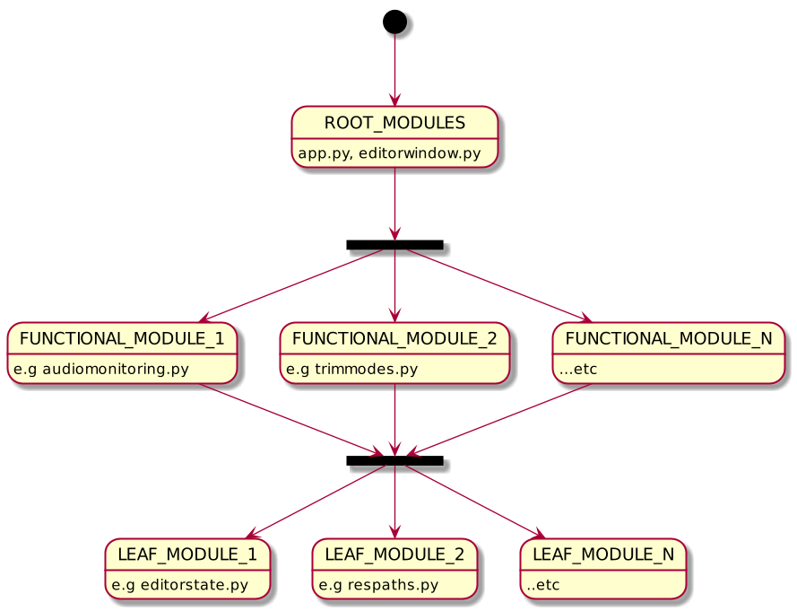
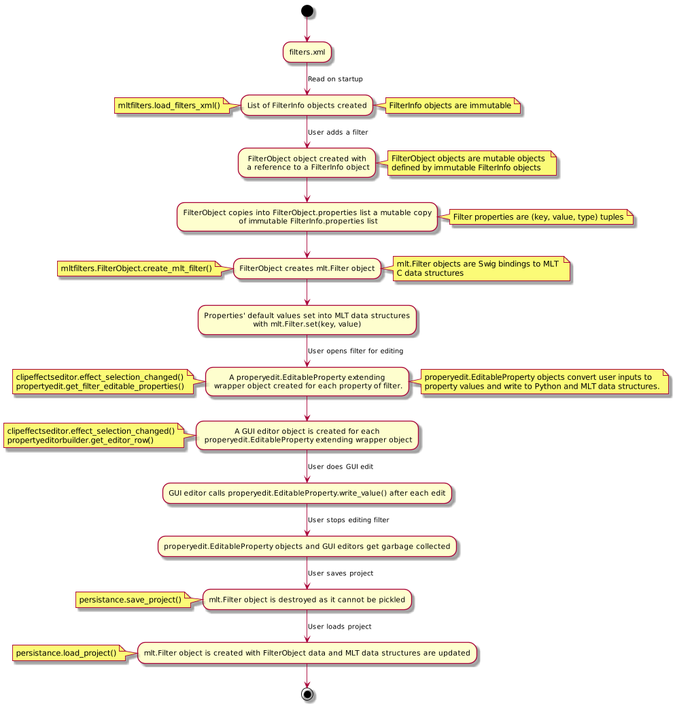
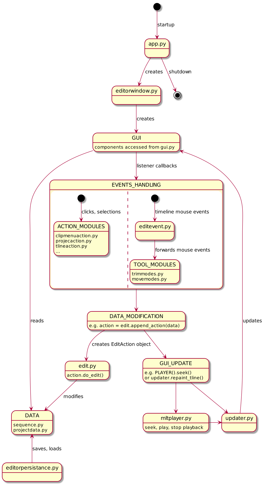

# Flowblade Codebase Overview

## 1. Introduction

This document aims to give a quick overview of Flowblade code base.

Document focuses on large fundamental structures and intentions present in the code base to make it easier to understand individual parts of functionality as parts of larger framework.

Diagrams are created with PlantUML  from the text files present in this directory.

## 2. Module design

The approach taken in structuring Flowblade code base is that **modules are considered to be divided into three categories** based on number of other *internal* modules they import:
  * **Root modules** import a large part of total number of modules
  * **Functional modules** import all modules required achieve their designed function
  * **Leaf Modules** only import *external* modules (which offer clear defined interface and do not make the code base structurally more complex)

**The goal of the design is to have the maximum amount of code in the Leaf Modules** and to have as little as possible interdependence between *Functional Modules*.

**Each new clearly defined functionality should be added by creating a new module** and connecting it in root modules to GUI callbacks and  into existing main paths in the application and importing the necessery *Leaf Modules*.

**Example:** When timeline sensitive cursor was introduced most of the new functionality was contained in module *snapping.py* that was imported by 3 other modules as needed.

We have successfully pushed a lot of the functionality into *Leaf Modules* which are imported into most of *Functional Modules*. We also seem to have a low rate of regressions when adding new functionality or fixing bugs.

Unfortunately import structures in *Functional Modules* often still remain complex and should be simplified further.

## 3. Data structures

**Flowblade maintains at all times two 100% synced data structures:**
  * Python data structures that are mainly described in *sequence.py* and *projectsdata.py*
  * MLT data structures that are managed via Swig objects described in extension *mlt.py*

**Python data structures that are considered authoritative over MLT data structures.**

User edits Python data structures. GUI presents view into Python data structures *except* with monitor view which displays the output of MLT tractor producer.

Python data structure values are copied into MLT data structures that create the viewable and renderable media output. **MLT data structures are destroyed on save and recreated on load.**

Since we are keeping two data structures at all times 100% synced we need to take extra care that at no point do the data structures deviate. **Writing to both data structures is constrained into very few code locales**, main ones being:
* *edit.py* lines 50 - 90 (marked *atomic edit ops*)
* *propertyedit.EditableProperty.write_value()*
* *propertyedit.TransitionEditableProperty.write_value()*

The reasoning behind the approach:
* constraining access to MLT data structures and separating clearly Python and MLT data structures was considered cleaner and more maintainable then an approach in which the line of separation between the two data structures would be unclear
* about 50% less Python FFI calls
* save and load using *pickle()* requires this

## 4. Filter editing pipeline

The conceptual approach taken in filter editing related code is that **the whole process is a data modifying pipeline.**

This approach has been massive success from correctness point-of-view. We have received maybe 2 bug reports of the 700+ filed against this close to 10K line portion of the program.

For anyone interested in understanding this functionality in more detail the best approach would be to go through the diagram above while reading the related code *(which is given in the notes on the left, notes on the right give some additional information on each step).*

## 5. Minimal viable diagram

This diagram attempts to show the smallest possible view describing application life cycle and main editing actions.
* *smalltext.py* names are Python modules
* *LARGE_TEXT* names show conceptually categorized code blocks
* *named arrows* give the types of interaction between the objects in the diagram

## 6. Current state of code base and future directions

We have been able to add new features and fix bugs with low level of regressions and from technical perspective there is no clear need to start re-architecting the application.

We can however achieve improvements in readability and maintainability of the code with number of possible refactorings:
* push as much as possible code into *Leaf Modules*
* remove imports from modules by creating new smaller modules with fewer or zero (internal) imports
* *editorstate.py* can be made smaller by moving same multimodule state into smaller modules like maybe *monitorstate.py* and leaving only the truly global state in *editorstate.py*
* cut some central large modules into smaller ones, candidates include:
  * tlinewidgets.py could have overlay code extracted into module tlineoverlay.py
  * popup menus code can be extracted from guicomponents.py
  * tools related code can removed from editorwindow.py
* it is maybe possible to communicate filters editing pipeline better by creating a filterspipeline.py module
* we have number of *main()* functions for tools started on separate processes and they have shared code which is all duplicated
